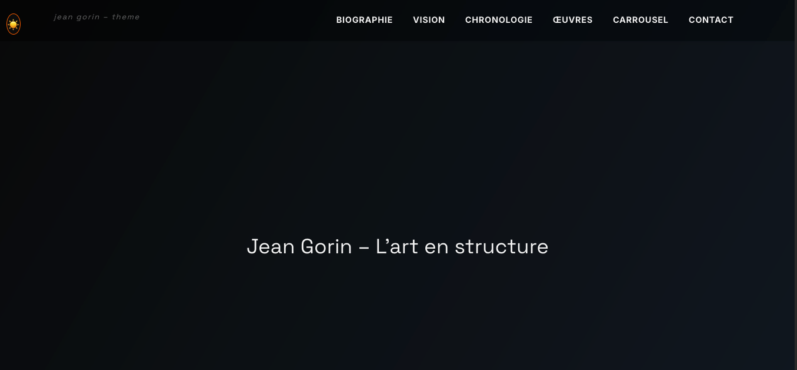
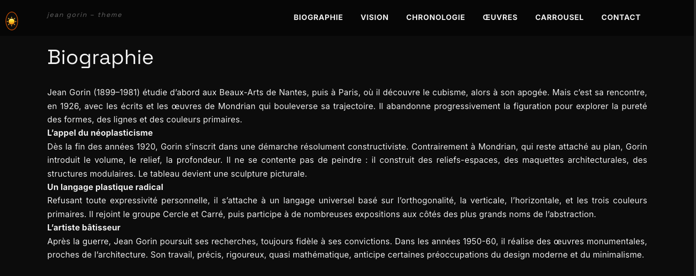
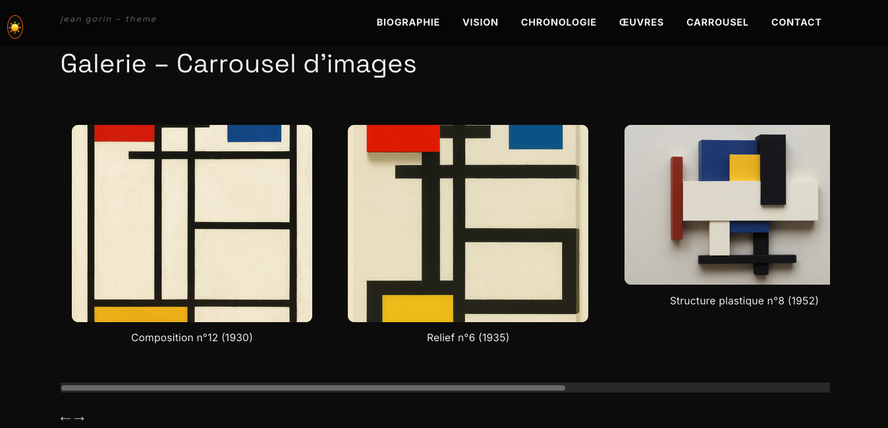

# 🎨 Jean Gorin – Template Portfolio Artistique

Un **template web responsive et moderne** rendant hommage à Jean Gorin, conçu pour servir de base à tout **portfolio artistique** : peintre, sculpteur, architecte, photographe, designer, etc.

> ✨ Inspiré par le néoplasticisme et l’univers de Jean Gorin, ce thème ultra-moderne évoque la rigueur géométrique, la clarté plastique, et la sensibilité typographique du Bauhaus.

---

## 📸 Aperçu

> Screenshots à insérer ici (format Markdown une fois disponibles) :
```



```

---

## 📦 Fonctionnalités

- 🌗 Thème clair / sombre dynamique avec persistence locale
- 🎯 Responsive design 100% fluide (mobile > 4K)
- 🖼️ Carrousel tactile et clavier
- 🧱 Parallaxe doux (desktop only)
- 🧭 Scroll fluide + navigation intuitive
- 🧑‍🎨 Structure pensée pour les artistes (biographie, vision, œuvres, galerie…)

---

## 🧩 Technologies utilisées

- **HTML5 sémantique**
- **CSS3 / SCSS** (reset moderne, animations, dark-mode)
- **JavaScript ES6+** (DOM, events, localStorage, IntersectionObserver)
- Aucune dépendance externe (aucun framework requis)

---

## 📁 Arborescence

```
JeanGorin-theme/
├── index.html
├── assets/
│   ├── css/
│   │   ├── style.css
│   │   ├── reset.css
│   │.  │
│   │   ├── animations.css
│   │   ├── carousel.css
│   │   └── theme-toggle.css
│   ├── js/
│   │   ├── main.js
│   │   ├── parallax.js
│   │   ├── theme-toggle.js
│   │   └── carousel.js
│   └── img/
│       ├── composition12.jpg
│       ├── relief6.jpg
│       ├── structure8.jpg
│       ├── maquette3.jpg
│       └── ... (autres œuvres)
```

---

## 🚀 Utilisation & déploiement

### 1. Télécharger le template

- Soit via [Code > Download ZIP](https://github.com/roussov/JeanGorin-theme)
- Soit via Git :
```bash
git clone https://github.com/roussov/JeanGorin-theme.git
```

### 2. Éditer le contenu

- Modifier `index.html` : textes, titres, images, sections.
- Changer les fichiers `.jpg` dans `assets/img/` avec vos propres œuvres.
- Personnaliser le style dans `assets/css/style.css` ou `responsive.css`.

### 3. Tester localement

Ouvrez `index.html` dans votre navigateur préféré.

### 4. Mettre en ligne

- **GitHub Pages**
- **Netlify**, **Vercel**, **Firebase Hosting**, etc.
- Ou votre propre hébergeur FTP

---

## 🔐 Conseils de sécurité

- N'ajoutez jamais de mot de passe, email ou informations sensibles en dur dans le code.
- Évitez d’utiliser de scripts tiers sans vérification de leur sécurité.
- Ne pas modifier le `localStorage` pour autre chose que le thème.

---

## 📋 Pré-requis

- Aucune compétence backend requise
- Éditeur recommandé : **VSCode**
- Connaissances de base en HTML/CSS pour personnaliser

---

## ⚖️ Droits d’auteur & licence

> 🧠 Projet original de Vincent Roussov (2025)  
Inspiré de l’œuvre de Jean Gorin, ce projet est une base librement modifiable dans un cadre non commercial.

- Tous les textes du site peuvent être adaptés.
- Les images doivent être remplacées par les vôtres pour un usage personnel ou professionnel.
- **Licence Creative Commons Attribution - Pas d’Utilisation Commerciale - Pas de Modification**

---

## 🤝 Aide & contributions

- En cas de bug : ouvrez une issue
- Suggestions ? Fork bienvenu
- Besoin d’un accompagnement personnalisé ? Contactez-moi !

---

> 🔧 Ce template est conçu pour faire rayonner **votre** art, sans friction technique.
> 🎨 Laissez parler les lignes, les formes, et vos idées.

# JeanGorin-theme
